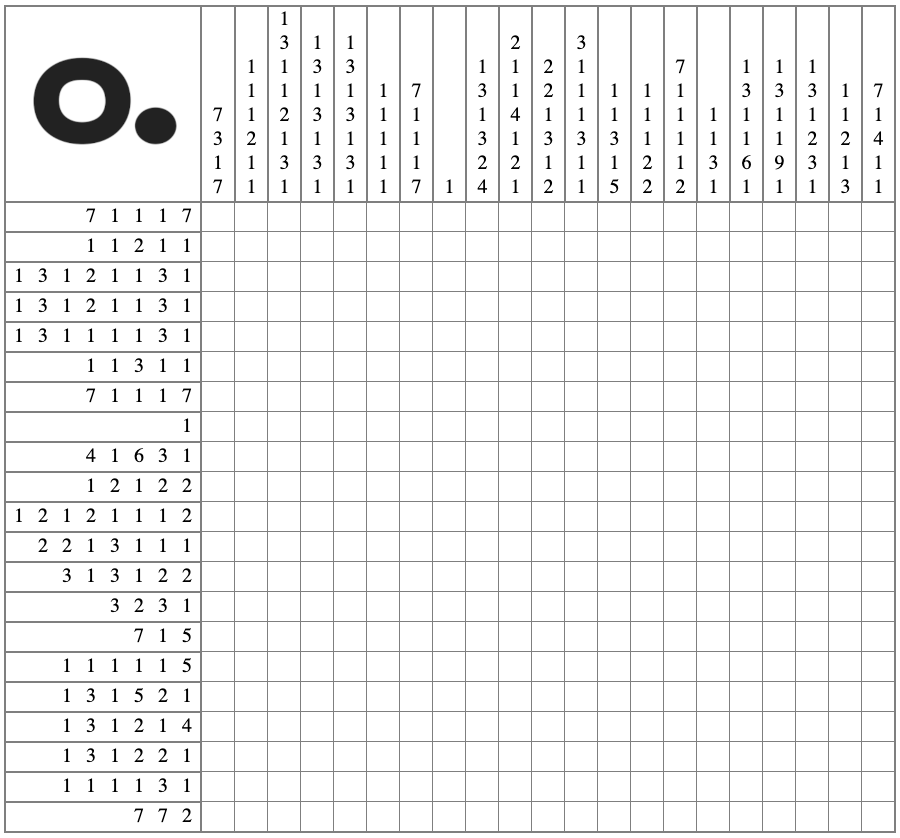
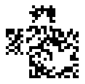

# Challanges

## DEFAULT

Mifare Classic 1k - default

Make sure to check if the Magic card is valid using `hf 14a info`

```
hf mf csetblk --blk 44 -d 4f507b64306e745f7573335f64336634
hf mf csetblk --blk 45 -d 31745f6b6579357d0000000000000000
```

**Solution:**
`hf mf cview`
Read tag with Android phone using MIFARE Clasic Tool. Standard key FFFFFFFFFFFF. Decrypt the hex data to get the key.
Flag: `OP{d0nt_us3_d3f41t_key5}`

## Keys Keys Keys

Mifare Classic 1k - harder key

```
hf mf csetblk --blk 1 -d 57656c636f6d6520746f20746865204d
hf mf csetblk --blk 2 -d 6966617265206368616c6c616e676521

hf mf csetblk --blk 4 -d 54686520666c6167206973206e6f7420
hf mf csetblk --blk 5 -d 686572652e205472792074686973206b
hf mf csetblk --blk 6 -d 65793a20313132323333343435353636

hf mf csetblk --blk 8 -d 54686520666c6167206973206e6f7420
hf mf csetblk --blk 9 -d 686572652e205472792074686973206b
hf mf csetblk --blk 10 -d 65793a20414142424343444445454646

hf mf csetblk --blk 12 -d 54686520666c6167206973206e6f7420
hf mf csetblk --blk 13 -d 686572652e205472792074686973206b
hf mf csetblk --blk 14 -d 65793a20413041314132413341344135

hf mf csetblk --blk 16 -d 54686520666c6167206973206e6f7420
hf mf csetblk --blk 17 -d 686572652e205472792074686973206b
hf mf csetblk --blk 18 -d 65793a20423042314232423342344235

hf mf csetblk --blk 20 -d 54686520666c6167206973206e6f7420
hf mf csetblk --blk 21 -d 686572652e205472792074686973206b
hf mf csetblk --blk 22 -d 65793a20344230423230313037434342

hf mf csetblk --blk 24 -d 54686520666c6167206973206e6f7420
hf mf csetblk --blk 25 -d 686572652e205472792074686973206b
hf mf csetblk --blk 26 -d 65793a20323034373532343534313534

hf mf csetblk --blk 28 -d 54686520666c6167206973206e6f7420
hf mf csetblk --blk 29 -d 686572652e205472792074686973206b
hf mf csetblk --blk 30 -d 65793a20414346464646464646464646

hf mf csetblk --blk 32 -d 54686520666c6167206973206e6f7420
hf mf csetblk --blk 33 -d 686572652e205472792074686973206b
hf mf csetblk --blk 34 -d 65793a20363437314135454632443141

hf mf csetblk --blk 36 -d 54686520666c6167206973206e6f7420
hf mf csetblk --blk 37 -d 686572652e205472792074686973206b
hf mf csetblk --blk 38 -d 65793a20444541444245454545454546

hf mf csetblk --blk 40 -d 54686520666c6167206973206e6f7420
hf mf csetblk --blk 41 -d 686572652e205472792074686973206b
hf mf csetblk --blk 42 -d 65793a20423030303030303030304235

hf mf csetblk --blk 44 -d 54686520666c6167206973206e6f7420
hf mf csetblk --blk 45 -d 686572652e205472792074686973206b
hf mf csetblk --blk 46 -d 65793a20313233393837414234354141

hf mf csetblk --blk 48 -d 54686520666c6167206973206e6f7420
hf mf csetblk --blk 49 -d 686572652e205472792074686973206b
hf mf csetblk --blk 50 -d 65793a20414243444546363436343634

hf mf csetblk --blk 52 -d 54686520666c6167206973206e6f7420
hf mf csetblk --blk 53 -d 686572652e205472792074686973206b
hf mf csetblk --blk 54 -d 65793a20424545464245454642454546

hf mf csetblk --blk 56 -d 54686520666c6167206973206e6f7420
hf mf csetblk --blk 57 -d 686572652e205472792074686973206b
hf mf csetblk --blk 58 -d 65793a20313333333337414243444546

hf mf csetblk --blk 60 -d 57656c6c20646f6e6521204865726520
hf mf csetblk --blk 61 -d 697320796f757220666c6167202d204f
hf mf csetblk --blk 62 -d 507b6b6579735f6172655f6576696c7d

hf mf csetblk --blk 11 -d 11223344556608778F00112233445566
hf mf csetblk --blk 15 -d AABBCCDDEEFF08778F00AABBCCDDEEFF
hf mf csetblk --blk 19 -d A0A1A2A3A4A508778F00A0A1A2A3A4A5
hf mf csetblk --blk 23 -d B0B1B2B3B4B508778F00B0B1B2B3B4B5
hf mf csetblk --blk 27 -d 4B0B20107CCB08778F004B0B20107CCB
hf mf csetblk --blk 31 -d 20475245415408778F00204752454154
hf mf csetblk --blk 35 -d ACFFFFFFFFFF08778F00ACFFFFFFFFFF
hf mf csetblk --blk 39 -d 6471A5EF2D1A08778F006471A5EF2D1A
hf mf csetblk --blk 43 -d DEADBEEEEEEF08778F00DEADBEEEEEEF
hf mf csetblk --blk 47 -d B000000000B508778F00B000000000B5
hf mf csetblk --blk 51 -d 123987AB45AA08778F00123987AB45AA
hf mf csetblk --blk 55 -d ABCDEF64646408778F00ABCDEF646464
hf mf csetblk --blk 59 -d BEEFBEEFBEEF08778F00BEEFBEEFBEEF
hf mf csetblk --blk 63 -d 133337ABCDEF08778F00133337ABCDEF

```

**Solution:** 
Read the first sector and get the key to the next sector. Use an app such as MIFARE Classic Tool on Android.
Flag: `OP{keys_are_evil}`

## Matryoshka

Mifare Classic 1k - Encrypted ZIP-file

```
hf mf csetblk --blk 4 -d 504b0304140009000800f8445a55f3e5
hf mf csetblk --blk 5 -d 286445010000b901000009001c00666c
hf mf csetblk --blk 6 -d 61672e6a706567555409000353f25863
hf mf csetblk --blk 8 -d 55f2586375780b000104e803000004e8
hf mf csetblk --blk 9 -d 0300005d6f4d41ac16e036bb5dd8b98a
hf mf csetblk --blk 10 -d 6b1087c9b37e0f1465747d290105824f
hf mf csetblk --blk 12 -d 49e60915e45b6c9d8fcaf86bfef7087b
hf mf csetblk --blk 13 -d 66d30f87261950fb36898e4219b11718
hf mf csetblk --blk 14 -d 9a1ab1c6494c1cf906d4b73243c857ba
hf mf csetblk --blk 16 -d d2ea2d179e21a8703f1ae6f39d91a1ba
hf mf csetblk --blk 17 -d afd784a8e8d895497d75ed509c975a58
hf mf csetblk --blk 18 -d 62297f5fbf9e86303b663ce0213a5d52
hf mf csetblk --blk 20 -d 397d105c3216c2456aa3fb3022a2f2d9
hf mf csetblk --blk 21 -d 274b77bdb6d1429de52f7ddc427d2815
hf mf csetblk --blk 22 -d a955369cd14318789be02e98d58e7259
hf mf csetblk --blk 24 -d e9347499a6a538dcf13f0d33482e716b
hf mf csetblk --blk 25 -d a248722466f519cb1c1e38ad180cb919
hf mf csetblk --blk 26 -d 9ebdb85d18df73711d7bbcfed3b6e472
hf mf csetblk --blk 28 -d 0e98cd504f14adb9f0f1eea319ad59b1
hf mf csetblk --blk 29 -d 89302ca0116a49fed9fe7cbb41380f6e
hf mf csetblk --blk 30 -d 3fc7ca56e32ed4cfaa072e1fee251335
hf mf csetblk --blk 32 -d b8b2cd1a1c9b664f29b45ac192ee3f42
hf mf csetblk --blk 33 -d 251df78df561718cb7616c74eadaa13a
hf mf csetblk --blk 34 -d f45e156849ecd6baa7a226093525bb78
hf mf csetblk --blk 36 -d da32d42c8ea8955f504b0708f3e52864
hf mf csetblk --blk 37 -d 45010000b9010000504b01021e031400
hf mf csetblk --blk 38 -d 09000800f8445a55f3e5286445010000
hf mf csetblk --blk 40 -d b9010000090018000000000000000000
hf mf csetblk --blk 41 -d a48100000000666c61672e6a70656755
hf mf csetblk --blk 42 -d 5405000353f2586375780b000104e803
hf mf csetblk --blk 44 -d 000004e8030000504b05060000000001
hf mf csetblk --blk 45 -d 0001004f000000980100000000000000

```

Solution:
First read the Mifare Classic 1k card and dump the contents.
When put together this assembles an encrypted ZIP file with the password `(omega)` that is available in rockyou.
The file `flag.jpeg` contains hex data in the `Artist` and `Comment` field. When base64 decoded you get the flag.
Flag: `OP{cracking_makes_computer_go_brrr}`

## Katze Vermisst


********************Solution:********************
Call the number on the poster and wait for voicemail. Write down the flag that is said in german.
Flag: `OP{TH3_C4T_15_BACK}`

## Big In Japan

This is a puzzle called nonogram.



**Solution:**
When the nonogram is solved, it will reveal a QR code that can be scanned to get the flag.
Flag: `OP{OPKoKoTokyo}`


## qroken

A QR code has been stripped of some important information. Can you fix it?



**Solution:**
Draw the required pixels to fix the QR code. These pixels are standardized for every QR code of this size. Scan the QR code for the flag.
Flag: `OP{klipp_0ch_klistra}`


## Hurts My Brain

Brainfuck printed on paper.

```
++++++++++[>+>+++>+++++++>++++++++++<<<<-]>>>+++++++++.+.>+++++++++++++++++++++++.<++++++++++++++++++++.+++++.-----.-----.>--.<<++++++++++++++++++.>>----.<.>.--.<++++++.------.----------------.------------.+++++++++++++++.<+++++++++++++++.>>++++++++++.
```

**Solution:**
Use OCR or write down the code and run it through a [interpreter online](https://www.dcode.fr/brainfuck-language).
Flag: `OP{did_y0u_use_OCR?}`

## Lockpicking #1

**Solution:**
Pick the lock and get the flag.
Flag: `OP{ok_this_was_easy}`

## Lockpicking #2

**Solution:**
Pick the lock and get the flag.
Flag: `OP{lockpicking_lawyer}`

## 1Password

The flag is hidden in the shared Omegapoint vault in 1Password.

**Solution:**
Login to the Omegapoint 1Password account and get the flag in the note.
Flag: `OP{Summer2023_here_we_go}`


# **Fledermaus**

**Solution:**
Use an online decoder
[https://www.dcode.fr/itc-zapf-dingbats](https://www.dcode.fr/itc-zapf-dingbats)
Flag: `OP{th4ts_fr3ak1n_b4ts}`

# Only humans allowed

**Solution:**
Check the /robots.txt file
[https://opkoko.quest/robots.txt](https://opkoko.quest/robots.txt)

[https://opkoko.quest/gyrf9g7l64](https://opkoko.quest/gyrf9g7l64)
Flag: `OP{r0B0t_0v3Rl0rdZ}`

# Due Diligence

**Solution:**
[https://twitter.com/vocro_corp/status/1651261547929387020](https://twitter.com/vocro_corp/status/1651261547929387020)
[https://www.instagram.com/p/CsEd86hKuQE/](https://www.instagram.com/p/CsEd86hKuQE/)
[https://www.instagram.com/explore/locations/229426160413805/super-secret-underground-bunker/](https://www.instagram.com/explore/locations/229426160413805/super-secret-underground-bunker/)
[https://github.com/electrocryptid/secret-notes/commit/747099c3ce9fffcc4054400aca4c0d354abb55df](https://github.com/electrocryptid/secret-notes/commit/747099c3ce9fffcc4054400aca4c0d354abb55df)
Flag: `OP{pr0f3ssi0n4l_st4lk3r}`

# IT-Support

Solution:

Use `firmware-mod-kit` to extract the files.

```
firmware-mod-kit/extract-firmware.sh firmware.bin
grep -ir password
base64flag | base64 -d
```

Flag: `OP{d0nt_h4rdc0d3_cr3ds}`

# ROuTe to 1337

**Solution:**

```
https://cyberchef.org/#recipe=From_Base32('A-Z2-7%3D',true)From_Base32('A-Z2-7%3D',true)From_Base64('A-Za-z0-9%2B/%3D',true,false)ROT47(1337)&input=SkpLVlNWU0ZHUkZVVVNLT0dSRFVTVlNMSVJFVVVWU1dKNFpVV1FTTkdWR0VJUVpVSVJCRVdXU1hJWkNWT1UyV0paREVFUlNGS1laVTJSMkNLUkxFU1VKU0lORlVVVENFSUUzRUdWQ0tKWktGT05TVEdKSFVTVFNDSTVHVk1TU1NKTkZFNFJTTkdKRlVHUzJXSlZFRkdVS1RLWkdFRVZLVklWS1ZHV1NKTEZNVk9US1dKSkpFU1NTVElWSlZFU1MySlZERTJWMlpHSVpVUVNTS0pWQ1ZHVVpUSVZIVEtXS0VJNUlUR1QyTkpaREZPU0pWR05JVU9UU0NLNDJGU01TTUpWSkRHV0NCSlVaRUlUUzJLSktWT1dTRUxCSFVDV1NWSTRaVklSQ0tKWkpVUVRaVUlKS0VTVFNZSTVEVkdNMkZKNDJWU1JDSEtFWlU2VEtPSVpMVVNOSlRLRkRVNFFTWEdSTVRFVENOS0laVlFRS05HSkNFNFdTU0tWTFZVUkNZSlkyVEtSU0xLSkpGRVMyR0lWS1UyVktVSTVGRU1SQ0dJVk5FV1MyTElaTUZJVEtVTEpKVVlTSlVLWkhWRVRDUkk1TkVVVlpVSlZGVlNTMkNMQkRWU1VaU0s1RFU0TkNFS0ZKVVlUQ1BJSkhFT1MyV0dKRkU2UlNSSzVKVElSQ1E
```

Flag: `OP{4m_1_4lS0_l337_n0w?!?}`

# Dystopia

Frequency analysis

**Solution:**
[https://www.guballa.de/substitution-solver](https://www.guballa.de/substitution-solver)
Flag: `OP{B1G_BR0TH3R_1S_W4TCH1NG_Y0U}`

# Versteckspiel

**Solution:**
Find the hidden places.

Flag: `OP{h1d3_y82_4nd_5fq_s33k_:}`

# **In Plain Sight**

Solution:

strings on the binary

Flag: `OP{h1d1ng_1n_pla1n_s1gh7}`

# **Das Firmenbild**

Solution:

```
cat file.txt | base64 -d
steghide extract -sf omegapoint.jpg -p omegapointopkokoinberlin2023
cat flag.txt
```

Flag: `OP{ooH_yOu_fOunD_mE}`

# The Brutal Zip

zip2john 53cr3t.zip > john

john john --wordlist=/usr/share/wordlists/rockyou.txt

# Red Dragon

[https://gchq.github.io/CyberChef/#recipe=From_Hex('None')XOR({'option':'Latin1','string':'OPk0k0'},'Standard',false)&input=MDAwMDEwNTQ1ODA3MTA2MzE5NmYwMDQ1MjMwZjA2MDMwZjZmMGMwNDJkMTExNg](https://gchq.github.io/CyberChef/#recipe=From_Hex('None')XOR(%7B'option':'Latin1','string':'OPk0k0'%7D,'Standard',false)&input=MDAwMDEwNTQ1ODA3MTA2MzE5NmYwMDQ1MjMwZjA2MDMwZjZmMGMwNDJkMTExNg)
